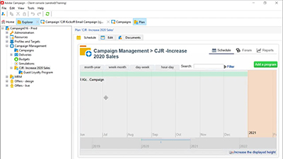

# Tutoriales de Adobe Campaign V8: Información general

Adobe Campaign ofrece una plataforma para diseñar experiencias en canales múltiples para los clientes y proporciona un entorno para la organización visual de la campaña, la administración de interacciones en tiempo real y la ejecución en canales múltiples. Esta guía del usuario contiene vídeos y tutoriales sobre las numerosas funciones y funcionalidades de Adobe Campaign V8.

>[!INFO]
> ¿Tiene preguntas? ¿Le gustaría compartir su experiencia o intercambiar ideas con sus colegas? O bien, ¿tiene comentarios sobre el contenido de aprendizaje para el equipo de Adobe? Únase a la conversación en el [hilo de la comunidad de aprendizaje de Adobe Campaign](https://experienceleaguecommunities.adobe.com/t5/adobe-campaign-classic/join-the-discussion-around-adobe-campaign-learning/td-p/419096).

>[!NOTE]
> Actualmente, Campaign v8 solo está disponible como Cloud Service administrado y no se puede implementar en entornos locales o híbridos. La migración desde un entorno de Campaign Classic v7 existente aún no está disponible.
>Consulte la [documentación del producto Classic v7 a V8](https://experienceleague.adobe.com/docs/campaign/campaign-v8/start/capability-matrix.html?lang=es) para obtener más información acerca de las diferencias entre las dos versiones. Consulte también la sección [Tutoriales de Campaign Classic V7](https://experienceleague.adobe.com/docs/campaign-classic-learn/tutorials/overview.html?lang=es) para ver vídeos con instrucciones.

## Novedades

* **[Panel de control de Campaign](https://experienceleague.adobe.com/docs/campaign-learn/control-panel/control-panel-overview.html?lang=es)**

   *Obtenga información sobre cómo monitorizar los activos clave y realizar tareas de gestión, como administrar el almacenamiento SFTP por instancia, o las claves GPG, e incluir direcciones IP en la lista de permitidos.*

## Nuestra selección

<table>
<tr>
  <td>
    
    

      <a href="/help/get-started/create-a-marketing-plan-programs-and-campaigns.md">
    <strong>Creación de un plan de marketing</strong>
    </a>
    

    

    <em>Obtenga información sobre cómo crear un plan, programa y campaña de marketing.</em>
    

  </td>
   <td>
    
    

      <a href="./content-creation/create-and-design-email-deliveries.md">
    <strong>Creación y diseño de entregas de correo electrónico</strong>
    </a>
    
 
    

    <em>Comprenda el proceso de creación de una entrega de correo electrónico, y obtenga información sobre cómo diseñar y personalizar el contenido del correo electrónico.
</em>
    

  </td>
  <td>
    
    

      <a href="./send-messages/fatigue-management/typology-rules-for-fatigue-management.md">
    <strong>Administración de la fatiga mediante reglas de tipología</strong>
    </a>
    

    

    <em>Obtenga información sobre cómo implementar la administración de la fatiga en Adobe Campaign mediante reglas de tipología. </em>
    

  </td>
</tr>
<tr>
</td>
  <td>
    
    

      <a href="./reporting/generate-a-descriptive-analysis-report.md">
    <strong>Generación de un informe de análisis descriptivo</strong>
    </a>
    

    

    <em>Obtenga información sobre cómo generar un informe de análisis descriptivo a partir de un flujo de trabajo.</em>
    

  </td>

</table>

## Recursos adicionales

* [Documentación](https://experienceleague.adobe.com/docs/campaign-v8.html?lang=es)
