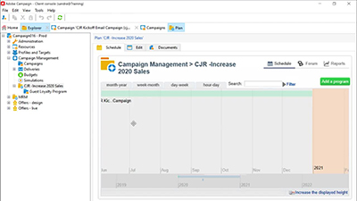
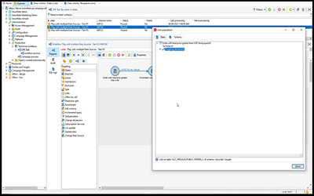

# Tutoriales de la consola del cliente de Adobe Campaign v8

Adobe Campaign ofrece una plataforma para diseñar experiencias en canales múltiples para los clientes y proporciona un entorno para la orquestación visual de la campaña, la administración de interacciones en tiempo real y Cross-channel Execution. Esta guía del usuario contiene vídeos y tutoriales sobre las numerosas funciones y funcionalidades de la consola de cliente de Adobe Campaign V8.

Consulte

>[!INFO]
> ¿Tiene preguntas? ¿Le gustaría compartir su experiencia o intercambiar ideas con sus colegas? O bien, ¿tiene comentarios sobre el contenido de aprendizaje para el equipo de Adobe? Únase a la conversación en el [hilo de la comunidad de aprendizaje de Adobe Campaign](https://experienceleaguecommunities.adobe.com:443/t5/adobe-campaign-classic/join-the-discussion-on-adobe-campaign-learning/td-p/419096).
> 
> ¿Estos tutoriales no son lo que buscaba?
> Consulte los [tutoriales de la interfaz de usuario web de Adobe Campaign](https://experienceleague.adobe.com/docs/campaign-web-learn/tutorials/overview.html?lang=es) para obtener información sobre cómo utilizar la interfaz de usuario web de Campaign.

>[!NOTE]
> Actualmente, Campaign v8 solo está disponible como Cloud Service administrado y no se puede implementar en entornos locales o híbridos. La migración automatizada desde un entorno de Campaign Classic v7 existente aún no está disponible.
>
>Consulte la [documentación del producto](https://experienceleague.adobe.com/docs/campaign/campaign-v8/new/v7-to-v8.html?lang=es) para obtener más información sobre la transición de Classic v7 a v8.

## Selección de personal

<table>
<tr>
  <td>
    
    

      <a href="/help/get-started/create-a-marketing-plan-programs-and-campaigns.md">
    <strong>Creación de un plan de marketing</strong>
    </a>
    

    

    <em>Obtenga información sobre cómo crear un plan, programa y campaña de marketing.</em>
    

  </td>
   <td>
    
    

      <a href="./content-creation/create-and-design-email-deliveries.md">
    <strong>Creación y diseño de envíos de correo electrónico</strong>
    </a>
    

    

    <em>Conozca el proceso de creación de un envío de correo electrónico, y aprenda a diseñar y personalizar el contenido del correo electrónico.
</em>
    

  </td>
  <td>
    
    

      <a href="./send-messages/fatigue-management/typology-rules-for-fatigue-management.md">
    <strong>Gestión de la fatiga utilizando reglas de tipología</strong>
    </a>
    

    

    <em>Obtenga información sobre cómo implementar la administración de la fatiga en Adobe Campaign mediante reglas de tipología. </em>
    

  </td>
</tr>
<tr>
</td>
  <td>
    
    

      <a href="./reporting/generate-a-descriptive-analysis-report.md">
    <strong>Generación de un informe de análisis descriptivo</strong>
    </a>
    

    

    <em>Obtenga información sobre cómo generar un informe de análisis descriptivo a partir de un flujo de trabajo.</em>
    

  </td>
  <td>
   
     

      <a href="./data-management/data-management-fundamentals.md">
    <strong>Conceptos fundamentales sobre la gestión de datos con flujos de trabajo</strong>
    </a>
    

    

    <em>Descubra cuáles son las dimensiones de segmentación y las tablas de trabajo, y cómo administra Adobe Campaign los datos en diferentes fuentes de datos.</em>
    

  </td>
  <td>
   
     

      <a href="./data-management/api-staging-mechanism.md">
    <strong>Mecanismo de ensayo de la API con FDAC</strong>
    </a>
    

    

    <em>Descubra cómo funciona el mecanismo de ensayo de la API con FDA completo.</em>
    

  </td>
</tr>
</table>

