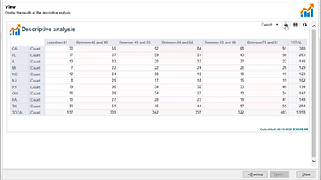

# Tutoriales de Adobe Campaign V8: Información general

Adobe Campaign proporciona una plataforma para diseñar experiencias de clientes en canales múltiples y proporciona un entorno para la organización de campañas visuales, la administración de interacciones en tiempo real y la ejecución en canales múltiples. Esta guía del usuario contiene vídeos y tutoriales sobre las numerosas funciones y funcionalidades de Adobe Campaign V8.

>[!INFO]
> ¿Tiene preguntas? ¿Le gustaría compartir su experiencia o intercambiar ideas con sus colegas? O bien, ¿tiene comentarios sobre el contenido de aprendizaje para el equipo de Adobe? Únase a la conversación en el [hilo de la comunidad de aprendizaje de Adobe Campaign](https://experienceleaguecommunities.adobe.com:443/t5/adobe-campaign-classic/join-the-discussion-on-adobe-campaign-learning/td-p/419096).

>[!NOTE]
> Actualmente, Campaign v8 solo está disponible como Cloud Service administrado y no se puede implementar en entornos locales o híbridos. La migración automatizada desde un entorno de Campaign Classic v7 existente aún no está disponible.
>
>Consulte la [documentación del producto](https://experienceleague.adobe.com/docs/campaign/campaign-v8/new/v7-to-v8.html) para obtener más información sobre la transición de Classic v7 a V8.

## Novedades

* **[Solución de problemas y análisis profundo del protocolo SMPP](https://experienceleague.adobe.com/docs/campaign-learn/set-up-sms-for-adobe-campaign/smpp-deep-dive-and-troubleshooting.html?lang=es)**

   *Aprenda cómo se establecen las conexiones SMPP y cómo SMPP intercambia datos a través de PDU. Obtenga información sobre cómo solucionar problemas de conexiones.*

* **[Panel de control de Campaign: monitorización de flujos de trabajo](https://experienceleague.adobe.com/docs/control-panel-learn/tutorials/performance-monitoring/monitor-workflows.html?lang=en){target=&quot;_blank&quot;}**

   *Obtenga información sobre cómo monitorizar el uso temporal del almacenamiento de sus flujos de trabajo y dónde ajustar la configuración de flujos de trabajo para evitar problemas de la base de datos o del flujo de trabajo en su instancia.*

* **[Panel de control de Campaign: monitorización de rendimiento y latencia](https://experienceleague.adobe.com/docs/control-panel-learn/tutorials/performance-monitoring/monitor-throughputs-and-latency.html?lang=en){target=&quot;_blank&quot;}**

   *Obtenga información sobre cómo monitorizar el rendimiento de entrega y las latencias de mensajes transaccionales de la instancia de Campaign.*

## Nuestra selección

<table>
<tr>
  <td>
    
    

      <a href="/help/get-started/create-a-marketing-plan-programs-and-campaigns.md">
    <strong>Creación de un plan de marketing</strong>
    </a>
    

    

    <em>Obtenga información sobre cómo crear un plan, programa y campaña de marketing.</em>
    

  </td>
   <td>
    
    

      <a href="./content-creation/create-and-design-email-deliveries.md">
    <strong>Creación y diseño de entregas de correo electrónico</strong>
    </a>
    

    

    <em>Comprenda el proceso de creación de una entrega de correo electrónico, y obtenga información sobre cómo diseñar y personalizar el contenido del correo electrónico.
</em>
    

  </td>
  <td>
    
    

      <a href="./send-messages/fatigue-management/typology-rules-for-fatigue-management.md">
    <strong>Administración de la fatiga mediante reglas de tipología</strong>
    </a>
    

    

    <em>Obtenga información sobre cómo implementar la administración de la fatiga en Adobe Campaign mediante reglas de tipología. </em>
    

  </td>
</tr>
<tr>
</td>
  <td>
    
    

      <a href="./reporting/generate-a-descriptive-analysis-report.md">
    <strong>Generación de un informe de análisis descriptivo</strong>
    </a>
    

    

    <em>Obtenga información sobre cómo generar un informe de análisis descriptivo a partir de un flujo de trabajo.</em>
    

  </td>
  <td>
   
     

      <a href="./data-management/data-management-fundamentals.md">
    <strong>Aspectos básicos de la administración de datos con flujos de trabajo</strong>
    </a>
    

    

    <em>Descubra cuáles son las dimensiones de segmentación y las tablas de trabajo, y cómo administra Adobe Campaign los datos en diferentes fuentes de datos.</em>
    

  </td>
  <td>
   
     

      <a href="./data-management/api-staging-mechanism.md">
    <strong>Mecanismo de ensayo de la API con FDAC</strong>
    </a>
    

    

    <em>Descubra cómo funciona el mecanismo de ensayo de la API con FDA completo.</em>
    

  </td>
</tr>
</table>

Consulte la [documentación del producto](https://experienceleague.adobe.com/docs/campaign-v8.html?lang=es) para obtener más detalles sobre esta función.
